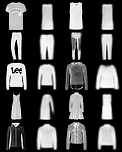
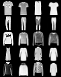
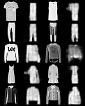

# Appendix

This appendix provides supplementary details on the model architectures, training procedures, and the comparative analysis performed on the FashionMNIST dataset.

---

## A. Technical and Implementation Details

### A.1. Model Architectures

The detailed architectures for the main models used in this work are provided below.

#### Spatial VAE Encoder
| Layer Type          | Channels In/Out | Kernel Size | Stride | Padding | Activation | Normalization |
| ------------------- | --------------- | ----------- | ------ | ------- | ---------- | ------------- |
| Conv2d              | `in_channels`/64  | 3x3         | 2      | 1       | ReLU       | Batch Norm    |
| Conv2d              | 64/128          | 3x3         | 2      | 1       | ReLU       | Batch Norm    |
| Conv2d              | 128/256         | 3x3         | 2      | 1       | ReLU       | Batch Norm    |
| Conv2d (for `mu`)   | 256/`latent_dim`  | 1x1         | 1      | 0       | -          | -             |
| Conv2d (for `logvar`)| 256/`latent_dim`  | 1x1         | 1      | 0       | -          | -             |
*Note: `in_channels` is 3 and `latent_dim` is 32 for the CIFAR-10 experiments.*

#### Spatial VAE Decoder
| Layer Type         | Channels In/Out | Kernel Size | Stride | Padding | Activation | Normalization |
| ------------------ | --------------- | ----------- | ------ | ------- | ---------- | ------------- |
| Conv2d             | `latent_dim`/256| 1x1         | 1      | 0       | -          | -             |
| ConvTranspose2d    | 256/128         | 4x4         | 2      | 1       | ReLU       | Batch Norm    |
| ConvTranspose2d    | 128/64          | 4x4         | 2      | 1       | ReLU       | Batch Norm    |
| ConvTranspose2d    | 64/`out_channels`| 4x4         | 2      | 1       | -          | -             |

#### Transformer
| Parameter              | Value     | Description                                |
| ---------------------- | --------- | ------------------------------------------ |
| `num_tokens`           | 512       | Size of the discrete codebook vocabulary.  |
| `embed_dim`            | 256       | Internal embedding dimension.              |
| `n_layers`             | 4         | Number of Transformer blocks.              |
| `n_head`               | 4         | Number of attention heads.                 |
| `max_seq_len`          | 16        | Sequence length from the 4x4 latent grid.  |
| `dropout`              | 0.1       | Dropout rate.                              |

### A.2. Training Hyperparameters

#### VAE Training
| Parameter              | Value     | Description                           |
| ---------------------- | --------- | ------------------------------------- |
| Optimizer              | AdamW     | -                                     |
| Epochs                 | 200       | With early stopping patience of 20.   |
| Batch Size             | 256       | -                                     |
| Learning Rate          | 1e-3      | -                                     |
| LR Schedule            | Cosine    | With `t_max` of 200.                  |
| Weight Decay           | 1e-5      | -                                     |
| Gradient Clipping      | 1.0       | Max norm for gradient clipping.       |
| $\beta$ (KL weight)    | 1.0       | -                                     |

#### Transformer Training
| Parameter              | Value     | Description                           |
| ---------------------- | --------- | ------------------------------------- |
| Optimizer              | AdamW     | -                                     |
| Epochs                 | 200       | -                                     |
| Batch Size             | 256       | -                                     |
| Learning Rate          | 3e-4      | -                                     |
| Weight Decay           | 0.01      | -                                     |
| Label Smoothing        | 0.1       | -                                     |

### A.3. Geodesic K-Medoids Algorithm

The geodesic quantization process is performed as follows, using the mean `mu` vectors from the VAE as input features. 

1.  **Build k-NN Graph:** A k-Nearest Neighbors graph is constructed from the latent vectors using Euclidean distance (k=50). Symmetrization is performed using the `union` method to maximize connectivity.
2.  **Re-weight with Riemannian Metric:** All unique edges in the graph are re-weighted using the decoder-induced Riemannian metric.
3.  **Find Largest Connected Component (LCC):** Clustering is performed only on the nodes within the LCC to ensure all points are reachable.
4.  **K-Medoids Clustering:** K-Medoids clustering (K=512) is performed on the re-weighted graph. Distances are calculated as shortest paths via Dijkstra's algorithm, and medoids are initialized with a K-Means++ strategy.

### A.4. Dataset Preprocessing
Input images for both FashionMNIST and CIFAR-10 were normalized to the range `[-1, 1]`. For CIFAR-10, standard data augmentation (random horizontal flips and crops) was used during VAE training.

### A.5. Evaluation Metrics
The PSNR and SSIM metrics were calculated using custom implementations assuming an input image range of `[0, 1]`. As the data was normalized to `[-1, 1]`, the absolute values reported may be affected by this mismatch, but their relative values are consistent.

---

## B. Comparative Analysis on FashionMNIST

This section details the comparative analysis performed on the FashionMNIST dataset.

### B.1. Post-Hoc Quantization Methods

The analysis on FashionMNIST compared three distinct graph-based quantization schemes:

*   **Method 1: Graph Geodesic Clustering:** K-medoids on a Euclidean-weighted k-NN graph from a **vanilla VAE**.
*   **Method 2: Partial Riemannian Geodesic Clustering:** K-medoids on a hybrid graph from a **vanilla VAE** where a subset of 5,000 edges are re-weighted with the Riemannian metric.
*   **Method 3: Full Riemannian Geodesic Clustering:** K-medoids on a fully Riemannian-weighted graph from a **Spatial VAE**.

### B.2. Quantitative and Qualitative Results

The results, shown in Table 1 and Figure 1, reveal that the simpler graph geodesic method with Euclidean weights achieves the highest performance. The partial Riemannian correction provides a competitive result, while the full Riemannian method yields a lower reconstruction quality. This suggests that for this dataset, the limited application of the Riemannian metric may act as a form of regularization. It is crucial to note that the architectural difference (vanilla vs. spatial VAE) is a confounding variable in this comparison.

**Table 1 — FashionMNIST Quantization Method Comparison**

| Method                         | PSNR (dB) | SSIM   |
| ------------------------------ | --------- | ------ |
| Graph Geodesic (Euclidean)     | **33.42** | **0.9589** |
| Partial Riemannian Geodesic    | 31.95     | 0.9432 |
| Full Riemannian Geodesic       | 9.84      | 0.5168 |

**Figure 1 — Qualitative comparison of FashionMNIST reconstructions**

| Method 1: Graph Geodesic (Euclidean) | Method 2: Partial Riemannian Geodesic | Method 3: Full Riemannian Geodesic |
| --- | --- | --- |
|  |  |  |

In each image, the top row shows original images and the bottom row shows their reconstructions. The visual quality directly corresponds to the quantitative results.
